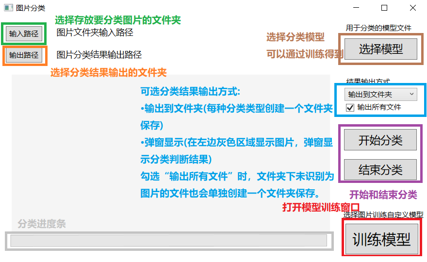
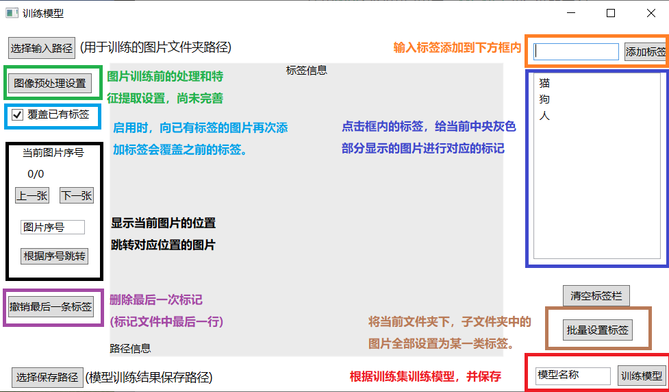

# 简介

一个简单的.NET图片分类应用，可以自己训练分类模型并使用。

使用[WPF](https://github.com/dotnet/wpf)创建用户界面，[ML.NET](https://github.com/dotnet/machinelearning)进行机器学习。

# 功能

- 图片分类

选择包含图片的文件夹，使用训练好的模型对其中的图片进行分类，分类结果弹窗展示或输出到文件夹。

- 分类模型训练

选择一些图片，通过单独或批量的方式进行标记，作为训练集训练得到分类模型。

# 运行需求

Windows 7及以上操作系统

# 具体操作

## 分类界面

1. 选择输入图片的文件夹路径和模型

2. 选择分类结果输出方式：
- 选择 输出到文件夹 时:需要选择输出路径，点击开始分类按钮后，图片会复制到输出路径下对应类型的文件夹中。

- 选择 弹窗显示 时:图片会依次显示在左侧灰色区域，并弹窗显示分类结果。

## 训练界面

1. 选择用于训练的图片的导入路径，和训练得到模型的导出路径。

2. 选择图片导入路径后，会加载文件夹下的图片，并显示在中央灰色区域，点击右侧的标签栏中的标签，就可以给图表进行对应标注作为模型的训练集。

3. 进行一定量的标注后(不需要标注文件夹下的所有图片)，点击右下角训练模型就可以训练并保存模型，用于分类窗口的图片分类。

# 开发环境

Visual Studio 2022

## 工作负荷

.NET 桌面开发

## NuGet 包需求

Microsoft.ML 2.0.0

Microsoft.ML.CpuMath 2.0.0

Microsoft.ML.DataView 2.0.0

Microsoft.ML.ImageAnalytics 2.0.0

Microsoft.ML.TensorFlow 2.0.0

Microsoft.ML.TensorFlow.Redist 0.14.0

# 参考

[ML.NET 文档 - 教程和 API 参考 | Microsoft Learn](https://learn.microsoft.com/zh-cn/dotnet/machine-learning/)

[seabluescn/Study_ML.NET: 微软机器学习框架ML.NET学习笔记。 (github.com)](https://github.com/seabluescn/Study_ML.NET)

[适用于 .NET 5 的 Windows Presentation Foundation 文档 | Microsoft Learn](https://learn.microsoft.com/zh-cn/dotnet/desktop/wpf/?view=netdesktop-6.0)

